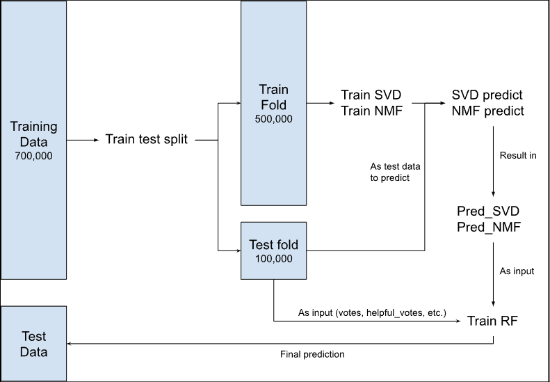

# Recommender System Using Stacking Ensemble with Random Forest Regression

This project demonstrates the implementation of a recommender system using a stacking ensemble method. The approach leverages multiple collaborative filtering models and combines their predictions using a Random Forest regressor. While ensemble models are commonly used in machine learning, applying them effectively in recommender systems requires careful consideration, particularly when dealing with limited training data.

## Overview

The primary challenge addressed in this project is the limited data available for training the final model. Initially, the goal was to use a Random Forest model as the final predictor in an ensemble of collaborative filtering models like SVD, NMF, KNN, and Co-Clustering. However, a simple train-test split would have resulted in insufficient data to train the Random Forest model effectively, leading to potential overfitting and poor generalization.

## Stacking Methodology

### The Challenge

When I first set out to use a Random Forest regressor as the meta-model in an ensemble approach, it became evident that the typical train-test split wouldn't provide enough data to train the model effectively. With only about 100,000 rows available for training after the split, the model was likely to overfit, resulting in poor performance on unseen data.

### The Solution

To address this, I implemented a stacking methodology combined with cross-validation. This approach ensured that the Random Forest model was trained on a much larger and more diverse dataset, improving its ability to generalize.

1. **Cross-Validation and Stacking**: Instead of a single train-test split, the dataset was split into 5 folds using cross-validation. In each fold, the base models (SVD, NMF, KNN, and Co-Clustering) were trained on the training subset, and their predictions were made on the validation subset.

2. **Prediction Collection**: The predictions from these base models for each fold were collected. This process was repeated across all folds, resulting in predictions for every row in the original training dataset.

3. **Training the Meta-Model**: These predictions, along with other user features such as average rating, total votes, and helpful votes, were used to train the Random Forest regressor. This way, the Random Forest model could learn from a much larger and more representative set of data.

4. **Final Prediction**: When making the final predictions on the test data, the Random Forest model used the stacked predictions and the additional user features to produce the final ratings.

The diagram below illustrates this process:



### Advantages of the Stacking Approach

- **Better Generalization**: By collecting predictions across multiple cross-validation folds and training the Random Forest model on this comprehensive set, the model generalizes better to unseen data.
- **Reduction of Overfitting**: The larger and more diverse training set for the Random Forest regressor helps mitigate the risk of overfitting, which is a common issue when using limited training data.
- **Flexibility**: The stacking framework allows for easy adjustments, such as incorporating additional base models or more features, to further improve prediction accuracy.

## Key Features

- **Ensemble Learning**: Combines predictions from multiple collaborative filtering models (SVD, NMF, KNN, Co-Clustering) to improve accuracy.
- **Cross-Validation Stacking**: Utilizes cross-validation to generate diverse training data for the Random Forest model, enhancing generalization.
- **GPU Acceleration**: Leverages RAPIDS for faster model training on GPU, significantly reducing computation time.
- **Comprehensive Feature Set**: Incorporates additional features such as user rating patterns, total votes, and helpful votes to boost prediction accuracy.

## Running Instructions

### Prerequisites

- **GPU Requirement**: The code requires a T4 GPU to run efficiently due to the use of GPU-accelerated libraries like RAPIDS.
- **High RAM**: High memory is recommended for handling large datasets during training.

### Steps to Run the Code

1. **Mount Google Drive**: Access data and code by mounting Google Drive in Google Colab.
   ```
   from google.colab import drive
   drive.mount('/content/drive')
   ```

2. **Install Required Libraries**: Install necessary libraries, including RAPIDS for GPU-accelerated random forest training.
   ```
   !pip install implicit
   !pip install scikit-surprise
   !git clone https://github.com/rapidsai/rapidsai-csp-utils.git
   !python rapidsai-csp-utils/colab/pip-install.py
   ```

3. **Import Libraries**: Import all required libraries for data processing, model training, and evaluation.
   ```
   import implicit
   from sklearn.preprocessing import MinMaxScaler
   from sklearn.model_selection import KFold
   from sklearn.ensemble import RandomForestRegressor
   from surprise import SVD, NMF, Dataset, Reader
   import pandas as pd
   import numpy as np
   from tqdm import tqdm
   ```

4. **Load and Explore Data**: Load the training and test datasets, and perform initial exploration to understand the data structure.
   ```
   train_df = pd.read_csv('/train.csv')
   test_df = pd.read_csv('/test.csv')
   ```

5. **Cross-Validation and Stacking**: Run the cross-validation process to generate predictions from base models and stack them.
   ```
   kf = KFold(n_splits=5, shuffle=True, random_state=44)
   # Train base models and collect predictions across all folds
   ```

6. **Train Random Forest**: Use the collected predictions and additional features to train the Random Forest model.
   ```
   rf = RandomForestRegressor(n_estimators=150, max_depth=10, random_state=44)
   rf.fit(X_train, y_train)
   ```

7. **Make Final Predictions**: Generate the final predictions for the test data using the trained Random Forest model.
   ```
   y_pred = rf.predict(X_val)
   res = pd.DataFrame({'ID': range(len(y_pred)), 'rating': y_pred})
   res.to_csv('submission.csv', index=False)
   ```

## Conclusion

This project highlights the effectiveness of stacking ensemble methods in recommender systems, particularly when dealing with limited training data. By combining cross-validation with a stacking approach, the Random Forest regressor could be trained on a richer dataset, leading to better generalization and improved prediction accuracy.
